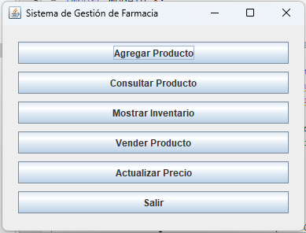
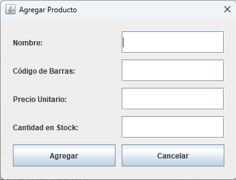
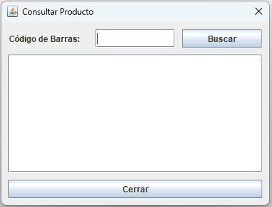
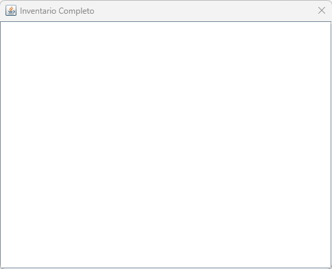
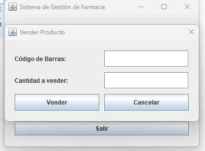
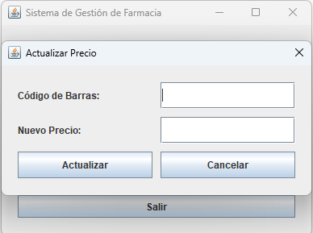

# Sistema de Gestión de Inventario para Farmacia

Este es un sistema de gestión de inventario diseñado para farmacias, implementado en Java con interfaz gráfica Swing.

## Funcionalidades Implementadas

1. Agregar Productos: Permite registrar nuevos productos con nombre, código de barras, precio y stock inicial.
2. Consultar Productos: Busca productos por su código de barras y muestra sus detalles.
3. Mostrar Inventario: Muestra una lista completa de todos los productos en el inventario.
4. Vender Productos: Permite registrar ventas y actualizar el stock automáticamente.
5. Actualizar Precios: Permite modificar el precio de cualquier producto existente.

### Instrucciones de Uso

1. Ejecutar la clase `MenuPrincipal` para iniciar la aplicación.
2. Usar los botones del menú principal para acceder a las diferentes funcionalidades.
3. Seguir las instrucciones en cada pantalla para completar las operaciones.
4. Muchas gracias por acatar las instrucciones.

## Capturas de Pantalla

### Menú Principal

### Agregar Producto

### Consultar Producto

### Inventario Completo

### Vender Producto

### Actualizar Precio

## Video Explicativo

[Ver en Google Drive](https://drive.google.com/file/d/1d8ghfMP2oDz-dUpu-roApcK79BZV202H/view?usp=drive_link)
